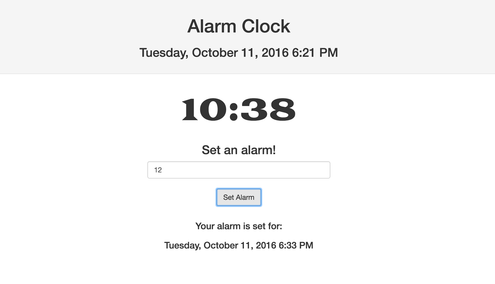

# Alarm Clock App

#### _10-11-16_

#### By _**Elysia Nason &amp; Aimen Khakwani**_

## Description

An alarm clock app that takes user input (in minutes) and counts down to it.

## Setup/Installation Requirements

* Clone the repository
* Using the command line, navigate to the project's root directory
* Install node dependencies by running $ npm install
* Install bower dependencies by running $ bower install
* Build the files by running $ gulp build
* Open index.html to view application in browser

## Known Bugs

* When the countdown is running, and a second input is submitted through the form, the countdown tries to run them both. The countdown either needs to reach 00:00, or the page needs to be refreshed.

## Technologies Used

_HTML,
CSS,
JavaScript,
Node,
Bootstrap
jQuery_

### License

*This webpage is licensed under the MIT license.*

Copyright (c) 2016 **_Elysia Nason &amp; Aimen Khakwani_**
